## 一、OpenLDAP简介
#### 1. 概述
&emsp;&emsp; LDAP是一款轻量级目录访问协议（Lightweight Directory Access Protocol，简称LDAP），属于开源集中账号管理架构的实现，且支持众多系统版本，被广大互联网公司所采用。</p>
&emsp;&emsp; LDAP提供并实现目录服务的信息服务，目录服务是一种特殊的数据库系统，对于数据的读取、浏览、搜索有很好的效果。目录服务一般用来包含基于属性的描述性信息并支持精细复杂的过滤功能，但OpenLDAP目录服务不支持通用数据库的大量更新操作所需要的复杂的事务管理或回滚策略等。</p>
&emsp;&emsp; LDAP具有两个标准，分别是X.500和LDAP。OpenLDAP是基于X.500标准的，而且去除了X.500复杂的功能并且可以根据自我需求定制额外扩展功能，但与X.500也有不同之处，例如OpenLDAP支持TCP/IP协议等，目前TCP/IP是Internet上访问互联网的协议。</p>
&emsp;&emsp; OpenLDAP可以直接运行在更简单和更通用的TCP/IP或其他可靠的传输协议层上，避免了在OSI会话层和表示层的开销，使连接的建立和包的处理更简单、更快，对于互联网和企业网应用更理想。</p>
&emsp;&emsp; OpenLDAP目录中的信息是以树状的层次结构来存储数据（这很类同于DNS），最顶层即根部称作“基准DN”，形如“dc=example,dc=local”类似于Windows AD中使用的方式。在根目录的下面有很多的文件和目录，为了把这些大量的数据从逻辑上分开，OpenLDAP像其它的目录服务协议一样使用OU（Organization Unit，组织单元），可以用来表示公司内部机构，如部门等，也可以用来表示设备、人员等。同时OU还可以有子OU，用来表示更为细致的分类。</p>

#### 2. OpenLDAP相关概念
- schema：主要用于控制目录树中各种条目的对象类以及各种属性的定义，并通过内部规范机制限定目录树条目所遵循的逻辑结构以及定义规范，保证整个目录树没有非法条目数据，避免不合法的条目存在目录树中，从而保证整个目录树信息的完整性、唯一性。（objectClass和Attribute由schema文件来规定）。

- objectClass：在OpenLDAP目录树中，每个条目必须包含一个属于自身条件的对象类（objectClass），然后再定义其条目属性及对应的值；OpenLDAP条目的属性能否添加取决于条目所继承的objectClass是否包含此属性，objectClass具有继承关系。

- Attribute：属性在目录树中主要用于描述条目相关信息，常用的属性包括：

| 属性 | 描述 |
| ------------ | ------------ |
| dn  | 唯一标识名 |
| rdn | 相对标识名  |
| uid | 一个用户的登录名称 |
| sn  | 一个人的姓氏 |
| giveName | 一个人的名字 |
| objectClass | 特殊属性，包含数据存储方式及相关属性信息 |
| dc | 一个域名 |
| cn | 一个对象的名称 |

- LDIF：轻量级目录访问协议数据交换格式的简称，是存储LDAP配置信息及目录内容的标准文本文件格式，通常在OpenLDAP服务器之间相互交换数据。


## 二、编译安装OpenLDAP
#### 1. 从官网下载OpenLDAP源码包，访问链接如下:
http://www.openldap.org/software/download/OpenLDAP/openldap-release/ </p>

#### 2. 安装相关依赖
```shell
[root@ldap ~]# yum install -y libtool-ltdl libtool-ltdl-devel openssl-devel
```

#### 3. 编译安装OpenLDAP
```shell
[root@ldap ~]# tar zxf openldap-2.4.44.tgz
[root@ldap ~]# cd openldap-2.4.44
[root@ldap openldap-2.4.44]# ./configure --prefix=/usr/local/openldap \
    --enable-bdb=no \
    --enable-hdb=no \
    --enable-ldap=yes \
    --enable-mdb=yes \
    --enable-monitor=no \
    --enable-accesslog \
    --enable-auditlog \
    --enable-syslog \
    --enable-modules \
    --enable-debug \
    --enable-overlays=yes \
    --enable-dyngroup=mod \
    --enable-dynlist=mod \
    --enable-memberof=mod \
    --enable-ppolicy=mod \
    --enable-crypt \
    --with-tls \

[root@ldap openldap-2.4.44]# make depend
[root@ldap openldap-2.4.44]# make 
[root@ldap openldap-2.4.44]# make install
```


## 三、添加OpenLDAP第三方密码复杂度检测插件
#### 1. 相关文档及下载地址
http://www.meddeb.net/pqchecker/ </p>
https://bitbucket.org/ameddeb/pqchecker/downloads/?tab=tags </p>

#### 2. 编译安装扩展插件
```shell
[root@ldap ~]# tar zxf ameddeb-pqchecker-e013630479bc.tar.gz
[root@ldap ~]# cd ameddeb-pqchecker-e013630479bc
[root@ldap ameddeb-pqchecker-e013630479bc]# ./configure \
    LDAPSRC=/root/openldap/openldap-2.4.44 \
    JAVAHOME=/usr/local/jdk1.8.0_251 \
    libdir=/usr/local/openldap/libexec/openldap \
    PARAMDIR=/usr/local/openldap/etc/openldap \
[root@ldap ameddeb-pqchecker-e013630479bc]# make
[root@ldap ameddeb-pqchecker-e013630479bc]# make install
```


## 四、使用rpm包安装OpenLDAP
#### 1. 使用定制rpm包安装（基于以上源码参数编译打包，包括了一些定制的配置，安装部署非常便捷）
[OpenLDAP-2.4.44-10.el7.x86_64.rpm](./Software/OpenLDAP-2.4.44-10.el7.x86_64.rpm)

#### 2. 安装OpenLDAP服务端
```shell
[root@local ~]# rpm -ivh OpenLDAP-2.4.44-10.el7.x86_64.rpm 
Preparing...                          ################################# [100%]
Updating / installing...
   1:OpenLDAP-2.4.44-10.el7           ################################# [100%]
Certificate:
    Data:
        Version: 3 (0x2)
        Serial Number:
            21:b3:b6:ef:03:c5:39:18:8f:16:db:55:7e:ea:c8:79:66:fa:6d:0c
    Signature Algorithm: sha256WithRSAEncryption
        Issuer: C=CN, ST=China, L=China, O=OpenLDAP, CN=example.local
        Validity
            Not Before: Mar  1 12:10:00 2022 GMT
            Not After : Mar 31 12:10:00 2022 GMT
        Subject: CN=example.local
        Subject Public Key Info:
            Public Key Algorithm: rsaEncryption
                Public-Key: (2048 bit)
                Modulus:
                    00:b7:90:05:d9:5b:dd:34:6e:78:7d:02:38:e9:1a:
                    e1:c5:67:e7:ec:93:5b:dc:04:5b:fb:e0:82:ca:52:
                    ad:eb:42:81:09:af:16:4a:02:c6:49:df:0e:af:66:
                    41:ae:75:0a:b4:05:fa:6b:0e:69:d7:f0:c8:3f:c5:
                    a4:5f:ab:4f:a1:5c:7b:35:dd:6e:e2:2e:ed:f7:9c:
                    14:21:03:fd:2e:90:d1:25:c4:cf:06:42:db:18:c3:
                    47:41:ab:19:da:49:f1:25:16:ca:a2:15:51:5b:60:
                    6a:3a:03:6d:28:4c:29:7c:f2:fe:2a:26:71:27:2f:
                    59:bf:66:35:d9:f5:03:10:ac:08:b4:a6:dc:e0:13:
                    15:65:e4:b6:d3:38:d3:3b:40:11:12:c8:eb:2c:90:
                    79:2a:3e:c5:f7:0b:4b:8e:2c:49:75:c4:db:80:aa:
                    5e:4e:18:35:f1:80:86:bb:2a:87:14:52:7c:ab:94:
                    a6:3c:eb:41:24:9d:f3:68:b8:3e:0e:9d:a5:58:85:
                    78:f1:07:b8:4a:a5:5e:11:e4:b8:06:9d:37:9c:5b:
                    bd:31:9b:8b:e2:d8:c7:dd:bc:ae:cf:2a:df:17:3d:
                    97:9f:fb:8a:07:b7:86:b4:58:93:75:a5:0f:0c:fd:
                    28:73:fa:e6:1a:45:a1:98:49:c4:b2:5b:dd:8e:d7:
                    ba:41
                Exponent: 65537 (0x10001)
        X509v3 extensions:
            X509v3 Key Usage: critical
                Digital Signature, Key Encipherment
            X509v3 Extended Key Usage: 
                TLS Web Server Authentication, TLS Web Client Authentication
            X509v3 Basic Constraints: critical
                CA:FALSE
            X509v3 Subject Key Identifier: 
                D0:8E:CD:D9:0A:97:E6:0B:67:13:C9:0E:5B:54:24:6F:14:18:ED:18
            X509v3 Authority Key Identifier: 
                keyid:99:8D:8D:D5:5A:CC:D7:EE:34:B0:05:89:51:39:73:23:87:85:54:71

            X509v3 Subject Alternative Name: 
                DNS:ldaps.example.local
    Signature Algorithm: sha256WithRSAEncryption
         58:25:b6:1e:5e:0c:93:e6:5f:d4:01:77:84:69:77:f7:e4:c3:
         7c:ad:ee:b3:5c:c7:06:a1:c6:49:ac:4e:84:eb:60:fa:bb:f0:
         0e:10:c6:e5:c5:e2:bc:47:95:d6:cd:90:05:5d:4e:a0:0e:d0:
         44:12:5a:89:a5:cd:6e:7a:a2:7b:2a:2a:c7:30:cc:d3:1c:67:
         a9:c1:08:a6:ce:1e:36:37:51:74:91:bd:d6:d3:46:4a:3b:2e:
         53:d3:af:3b:2c:eb:7c:a1:85:f9:da:a8:65:5a:52:2d:32:41:
         0c:b7:66:e0:29:86:e7:bd:be:34:4c:23:68:dd:f7:2b:11:72:
         27:ac:0c:aa:63:4b:f2:39:9e:4f:1d:fb:78:6a:fb:23:7a:5b:
         b5:c6:ea:5e:6d:ca:1b:f3:cb:b8:7b:45:3b:99:dd:3b:0f:2b:
         cd:13:e5:13:b0:3f:38:a8:3d:d3:e1:d9:87:b2:05:1e:27:4c:
         d5:4b:e4:aa:b0:8d:30:2f:6f:7e:e4:82:d0:9d:a6:59:fa:9b:
         c0:8b:bc:42:fc:ba:72:29:5e:00:8e:a9:85:98:80:03:fb:f9:
         49:ca:34:5b:42:26:71:82:a0:c0:c7:ef:ff:b0:d9:08:56:d0:
         9d:15:25:11:78:6f:ff:02:b5:6c:38:c9:e5:0f:ad:7c:36:ff:
         64:cc:6c:06

Starting OpenLDAP (pid: 82108)   [ OK ]

added: "dc=example,dc=local" (00000001)
added: "ou=ppolicy,dc=example,dc=local" (00000002)
added: "cn=defaults,ou=ppolicy,dc=example,dc=local" (00000003)
added: "ou=sudoers,dc=example,dc=local" (00000004)
added: "cn=defaults,ou=sudoers,dc=example,dc=local" (00000005)
_#################### 100.00% eta   none elapsed            none fast!         
Closing DB...
```

#### 3. OpenLDAP自动初始化（使用rpm包安装完OpenLDAP后会自动进行数据初始化，无需操作）
- 生成默认配置文件，位于"/usr/local/openldap/etc/openldap"目录下
- 修改hosts文件，添加"127.0.0.1 &emsp; ldaps.example.local"解析记录（注：默认域名为"ldaps.example.local"）
- 默认域为"dc=example,dc=local"
- 默认密码策略为"cn=defaults,ou=ppolicy,dc=example,dc=local"
- 默认密码复杂度为："0|00010101" （密码需要包含：1位小写字母、1位数字、1位特殊字符）
- 默认sudo配置为"cn=defaults,ou=sudoers,dc=example,dc=local"
- 服务启动为ldaps，监听636端口，证书位于"/usr/local/openldap/etc/openldap/cert"目录下
- 配置文件"/usr/local/openldap/etc/openldap/slapd.conf"定义了默认管理员账号密码，如下：</p>
&emsp;&emsp; 管理员账号：cn=admin,dc=example,dc=local </p>
&emsp;&emsp; 管理员密码：admin  &emsp;&emsp; （加密存储）</p>

#### 4. OpenLDAP服务管理
```shell
[root@ldap ~]# ldapctl
Usage: /usr/sbin/ldapctl {start|stop|status|restart|check|pass|cat}

# ldapctl start             # 启动slapd服务
# ldapctl stop              # 停止slapd服务
# ldapctl status            # 查看slapd服务状态
# ldapctl restart           # 重启slapd服务
# ldapctl check             # 检查slapd配置文件是否正确
# ldapctl pass              # 创建加密密码
# ldapctl cat               # 查看ldap数据，用于数据备份
```

#### 5. 修改OpenLDAP管理员密码
```shell
[root@ldap ~]# ldapctl pass
New password:                                       # 新密码
Re-enter new password:                              # 重复新密码
{SSHA}OpdOgZEAgrBb4olpbSwSOTPEW7Q/4Myq              # 加密后的密码

[root@ldap ~]# vi /usr/local/openldap/etc/openldap/slapd.conf     # 修改配置文件
rootdn      "cn=admin,dc=example,dc=local"
rootpw      {SSHA}OpdOgZEAgrBb4olpbSwSOTPEW7Q/4Myq                # 将rootpw值进行替换

[root@ldap ~]# ldapctl restart                                    # 重启openldap服务
Stopping OpenLDAP (pid: 26939)   [ OK ]
Starting OpenLDAP (pid: 27019)   [ OK ]
```

#### 6. 调整密码复杂度（按需调整）
```shell
[root@ldap ~]# vi /usr/local/openldap/etc/openldap/pqparams.dat 
# Data format: 0|UULLDDSS@)..
# Or         : 1|UULLDDSS@)..
#
# 1st character is the modified passwords broadcast flag. 1 -> Broadcast, 0 -> Don't broadcast
# 2nd character is a separator
# U: Uppercase, L: Lowercase, D: Digit, S: Special characters -> from 3rd to 10th charater.
# From the 11th character begins the list of forbidden characters
# Defaulti: No broadcast, 1 Uppercase, 1 Lowercase, 1 digit, 1 Special and no forbidden characters
0|00010101
```
```shell
0|00000000  共10位
     第1,2位默认使用"0|"
     第3,4位表示密码必须包含几位大写字母，01包含1位、02则包含2位
     第5,6位表示密码必须包含几位小写字母
     第7,8位表示密码必须包含几位数字
     第9,10位表示密码必须包含几位特殊字符
     例如：
      0|01010101       表示用户密码必须包含1位大写字母，1位小写字母，1位数字和1位特殊字符
      0|03020100       表示用户密码必须包含3位大写字母，2位小写字母和1位数字
```


## 五、基于CentOS7的客户端安装
#### 1. 安装openldap客户端工具
```shell
[root@local ~]# yum install openldap-clients
```

#### 2. 复制服务端证书"/usr/local/openldap/etc/openldap/certs/ca.pem"到客户端"/etc/openldap/certs/"目录下
```shell
[root@local ~]# ls -lh /etc/openldap/certs/ca.pem 
-rw-r--r-- 1 root root 1.3K Jan 13  2022 /etc/openldap/certs/ca.pem
```

#### 3. 修改openldap客户端配置文件
```shell
[root@local ~]# vi /etc/openldap/ldap.conf   # 追加以下内容
URI ldaps://ldaps.example.local
BASE dc=example,dc=local
TLS_CACERT /etc/openldap/certs/ca.pem
TLS_REQCERT allow
SUDOERS_BASE ou=sudoers,dc=example,dc=local
```

#### 4. 使用命令`ldapsearch -x`能够查询到相关服务端信息
```shell
[root@local ~]# ldapsearch -x
# extended LDIF
#
# LDAPv3
# base <dc=example,dc=local> (default) with scope subtree
# filter: (objectclass=*)
# requesting: ALL
#

# example.local
dn: dc=example,dc=local
...
```

#### 5. 安装配置nslcd服务
```shell
[root@local ~]# yum install nss-pam-ldapd
[root@local ~]# vi /etc/nslcd.conf           # 修改以下内容为
uri ldaps://ldaps.example.local
base dc=example,dc=local
tls_reqcert allow
tls_cacertfile /etc/openldap/certs/ca.pem
```
``` shell
[root@local ~]# systemctl restart nslcd
[root@local ~]# systemctl enable nslcd
```

#### 6. 修改"/etc/nsswitch.conf"文件
```shell
[root@local ~]# cp /etc/nsswitch.conf /etc/nsswitch.conf.old
[root@local ~]# vi /etc/nsswitch.conf       # 修以下三项内容为
passwd:     files ldap
shadow:     files ldap
group:      files ldap
```
```shell
sudoers:    files ldap                      # 在最后追加，sudoers需要此项
```

#### 7. 修改"etc/pam.d/system-auth"和"/etc/pam.d/password-auth"文件
```shell
[root@local ~]# vi /etc/pam.d/system-auth && vi /etc/pam.d/password-auth
auth        sufficient    pam_ldap.so use_first_pass                  # 在auth项的-2行插入
account     [success=ok user_unknown=ignore default=bad] pam_ldap.so  # 在account项的-2行插入
password    sufficient    pam_ldap.so use_autook                      # 在password项的-2行插入
session     optional      pam_ldap.so                                 # 在session项的-1行插入
session     optional      pam_mkhomedir.so                            # 在session项的-1行插入，用户第一次登录会自动创建home
```

#### 8. 备份"/etc/sudo-ldap.conf"文件并创建到"/etc/openldap/ldap.conf"的链接
```shell
[root@local ~]# mv /etc/sudo-ldap.conf /etc/sudo-ldap.conf.old
[root@local ~]# ln -sv /etc/openldap/ldap.conf /etc/sudo-ldap.conf
```


## 六、基于Ubuntu16、Ubuntu18、Debian9、Debian10的客户端安装
#### 1. 安装openldap客户端工具
```shell
root@local:~# apt install ldap-utils
```

#### 2. 复制服务端证书"/usr/local/openldap/etc/openldap/cert/ca.pem"到客户端"/etc/ldap/certs/"目录下
```shell
root@local:~# mkdir -p /etc/ldap/certs
root@local:~# ls -lh /etc/ldap/certs/ca.pem 
-rw-r--r-- 1 root root 1.3K Jan 12 22:18 /etc/ldap/certs/ca.pem
```

#### 3. 修改openldap客户端配置文件
```shell
root@local:~# vi /etc/ldap/ldap.conf
URI ldaps://ldaps.example.local
BASE dc=example,dc=local
TLS_CACERT /etc/ldap/certs/ca.pem
TLS_REQCERT allow
SUDOERS_BASE ou=sudoers,dc=example,dc=local
```

#### 4、使用命令`ldapsearch -x`能够查询到相关服务端信息
```shell
root@local:~# ldapsearch -x
# extended LDIF
#
# LDAPv3
# base <dc=example,dc=local> (default) with scope subtree
# filter: (objectclass=*)
# requesting: ALL
#

# example.local
dn: dc=example,dc=local
...
```

#### 5. 安装软件包"libpam-ldapd"和"libnss-ldapd"，安装完后修改"/etc/nslcd.conf"指定证书文件位置并重启服务
```shell
root@local:~# apt install libpam-ldapd libnss-ldapd
```


```shell
root@local:~# vi /etc/nslcd.conf
tls_cacertfile /etc/ldap/certs/ca.pem     # 调整此项
```
```shell
root@local:~# systemctl restart nslcd
root@local:~# systemctl stop nscd
root@local:~# systemctl disable nscd
```

#### 6. 修改"/etc/nsswitch.conf"文件
```shell
root@local:~# cp /etc/nsswitch.conf /etc/nsswitch.conf.old
root@local:~# vi /etc/nsswitch.conf       # 调整以下三项为
passwd:         files ldap
group:          files ldap
shadow:         files ldap
```
```shell
sudoers:        files ldap                # 在最后追加，sudoers需要此项
```

#### 7. 修改"/etc/pam.d/common-session"文件
```shell
root@local:~# vi /etc/pam.d/common-session
session optional        pam_mkhomedir.so  # 在最后行添加，用户第一次登录会自动创建home
```

#### 8. 安装sudo-ldap
```shell
root@local:~# apt install sudo-ldap
```


## 七、用户管理
#### 1. 使用 [LdapAdmin](./Software/LdapAdmin-w64-1.8.3.zip) 登录openldap，连接信息如下
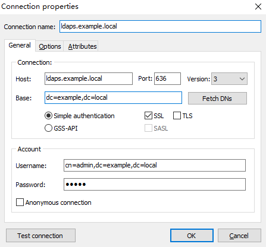

#### 2. 管理界面如下
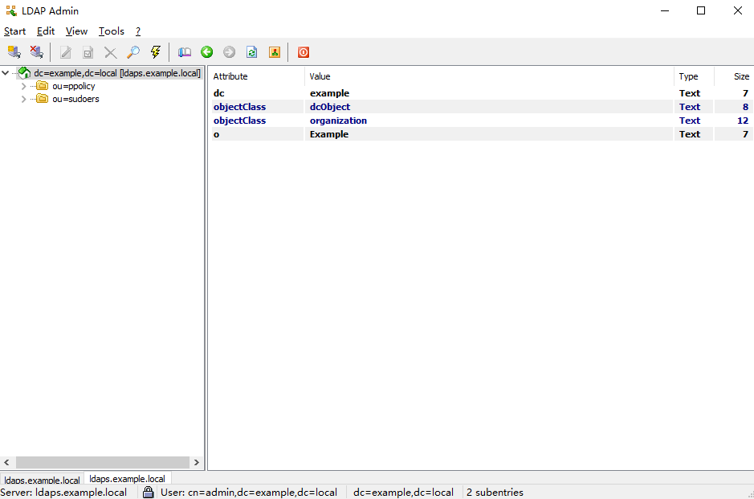

#### 3. 可以根据业务需求新建OU，例如："Users"
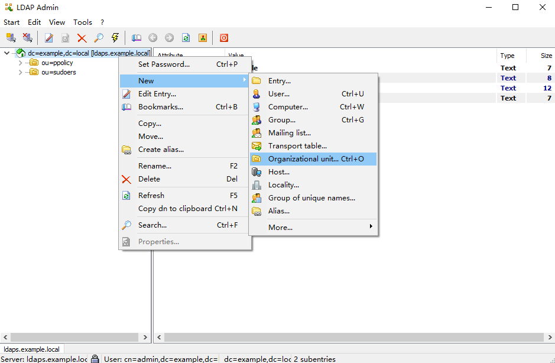
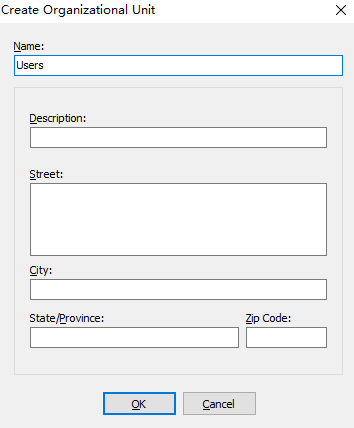

#### 4. 在OU下新建一个用户"user1"，先创建"user1"用户组
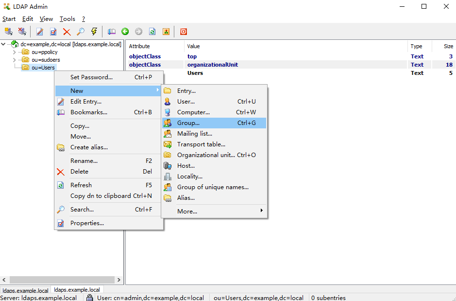
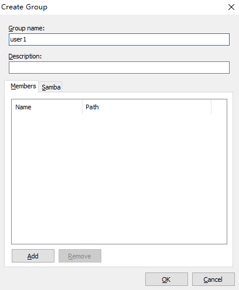

#### 5. "user1"用户组的"gid"包括用户的"uid"是随机分配的，建议提前规划（此处调整为5000）
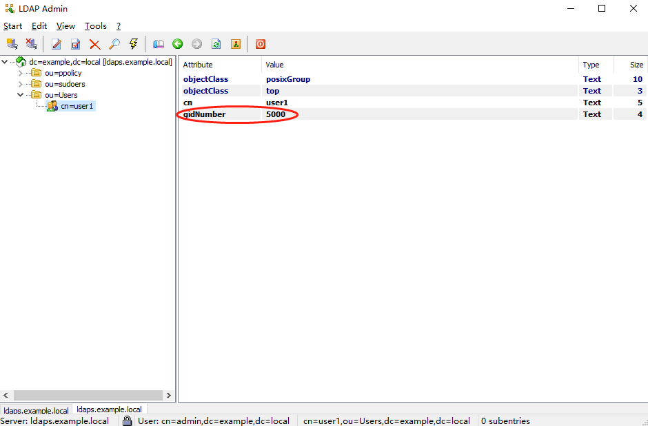

#### 6. 新建"user1"用户
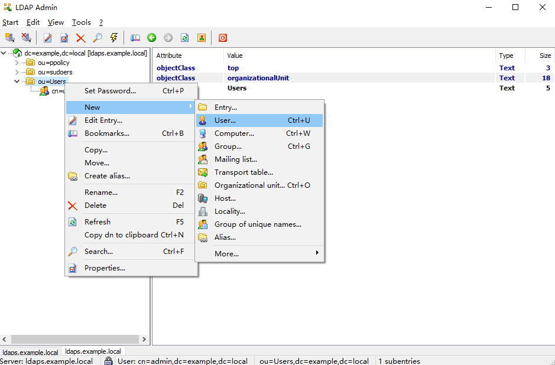
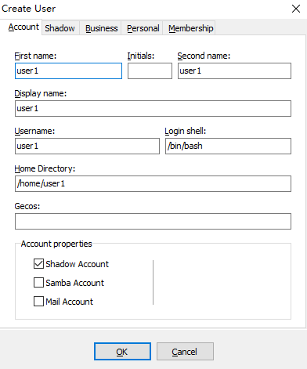 &emsp; 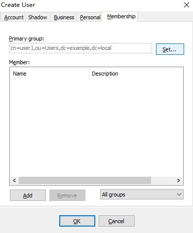

#### 7. 调整"user1"用户"uid"（此处调整为5000）
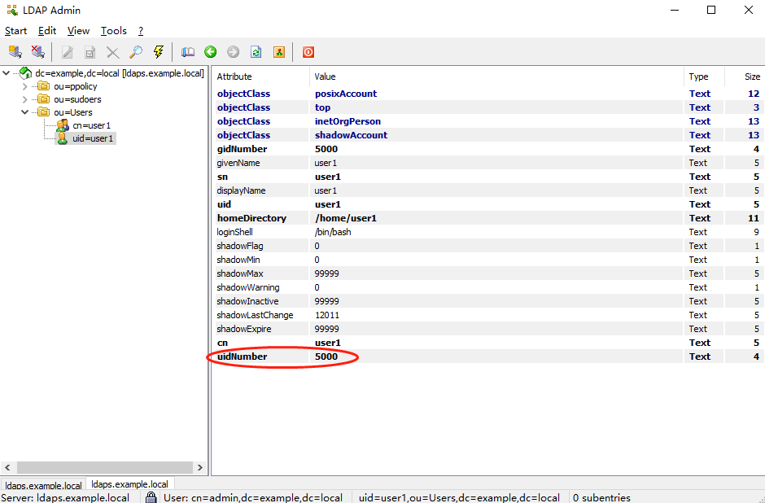

#### 8. 为用户设置初始密码
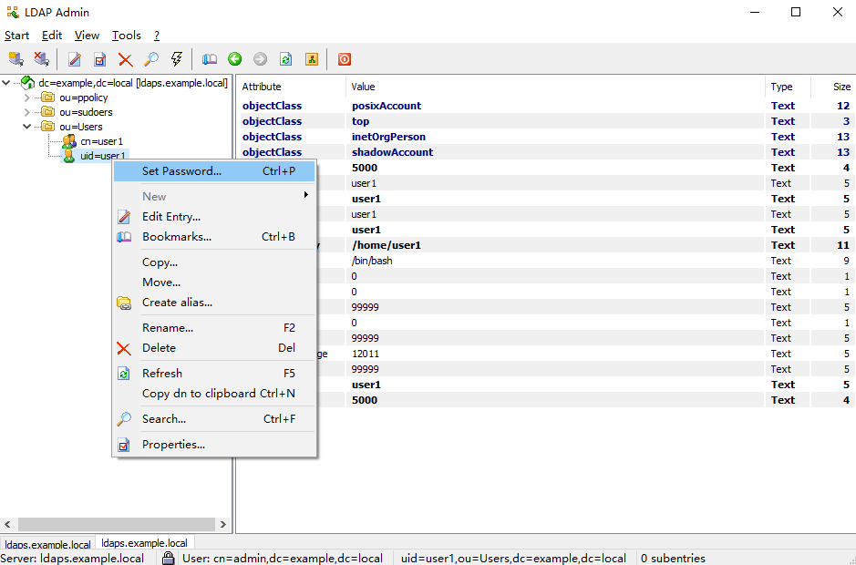 </p>
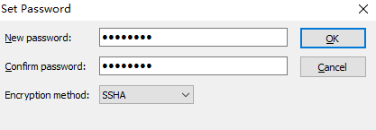

#### 9. 为了能够让用户登录即修改密码，可将"shadowLastChange"属性值修改为"0"
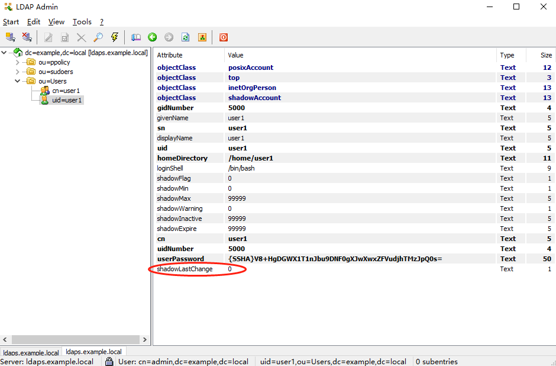

#### 10. 使用"user1"用户登录到已添加openldap客户端的服务器，第一次登录会强制修改密码
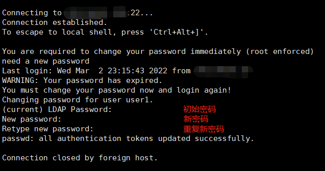

#### 11. 再次登录成功
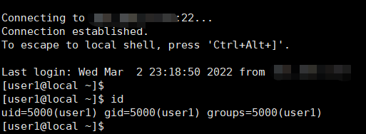

#### 附：用户的shadowAccount对象属性：
- shadowLastChange：密码从1970年1月1日开始, 到最近一次修改, 一共间隔了多少天. 比如这里指定成16967就表示2016年6月15日. 也可以直接获取当天的日期,方法为:在系统里useradd一个用户,查看/etc/shadow中该用户的第三个值, 即是该值. 该值如果设置成0, 则表示下次登陆将强制修改密码, 用户修改密码成功以后, 该值将发生对应的变化;
- shadowMin：密码从shadowLastChange指定的日期开始, 到多少天以后才能再次修改密码, 防止某些人天天没事就修改密码, 此值设置成0表示不限制;
- shadowMax：密码从shadowLastChange指定的日期开始, 到多少天以后过期(即多少天后必须更改密码);
- shadowInactive：密码过期以后还可以登陆多少天(每次登陆都会要求更改密码), 如果超过此值指定的天数, 下次登陆时会提示"Your account has expired; please contact your system administrator";
- shadowWarning：提前多少天开始警告用户密码将会过期;
- shadowExpire：密码从1970年1月1日开始, 多少天以后将会过期;
- shadowFlag：暂时无用


## 八、用户sudo管理
#### 1. openldap用户登录系统后默认为普通用户，可以在"ou=sudoers"下为用户分配sudo权限（和/etc/sudoers配置类似）
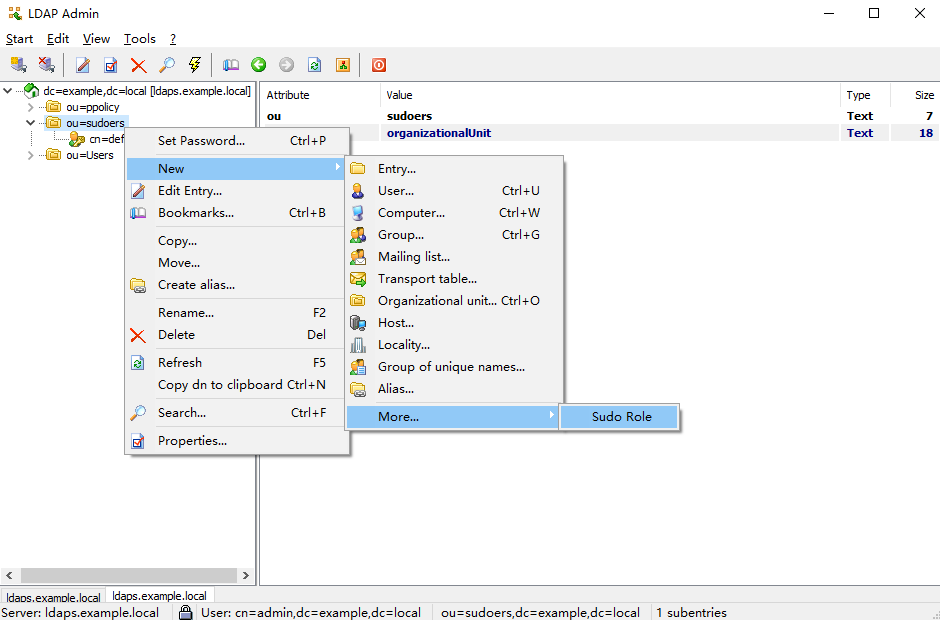
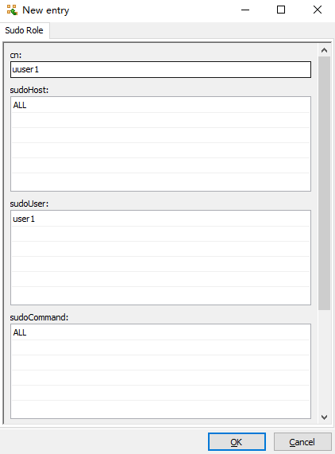

#### 2. 查看"user1"用户是否具有root权限
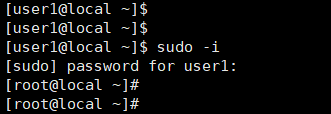

#### 3. 附：sudo属性定义
- sudoCommand：可执行的二进制命令
- sudoHost：可在哪些机器上执行sudoCommand定义的命令
- sudoUser：限制哪些用户具有sudo权限
- sudoOption：定义超过自身权限及切换至其他用户时，是否需要输入当前用户密码
- sudoRunAs：可切换到定义的用户身份下执行bash命令


## 九、OpenLDAP数据备份与恢复
#### 1. openldap数据备份
```shell
[root@ldap ~]# ldapctl cat > openldap-`date +%"Y%m%d"`.ldif
[root@ldap ~]# ls -lh openldap-20220302.ldif 
-rw-r--r-- 1 root root 5.2K Mar  2 01:43 openldap-20220302.ldif
```

#### 2. 在新服务器安装openldap，删除默认mdb文件
```shell
[root@ldap ~]# rpm -ivh OpenLDAP-2.4.44-10.el7.x86_64.rpm
[root@ldap ~]# cd /usr/local/openldap/var/openldap-data
[root@ldap ~]# rm -fr *.mdb
```

#### 3. 重启openldap服务
```shell
[root@ldap ~]# ldapctl restart
Stopping OpenLDAP (pid: 82108)   [ OK ]
Starting OpenLDAP (pid: 98476)   [ OK ]
```

#### 4. 恢复备份数据
```shell
[root@ldap ~]# /usr/local/openldap/sbin/slapadd -v -l openldap-20220302.ldif 
added: "dc=example,dc=local" (00000001)
added: "ou=ppolicy,dc=example,dc=local" (00000002)
added: "cn=defaults,ou=ppolicy,dc=example,dc=local" (00000003)
added: "ou=sudoers,dc=example,dc=local" (00000004)
added: "cn=defaults,ou=sudoers,dc=example,dc=local" (00000005)
added: "ou=Users,dc=example,dc=local" (00000006)
added: "cn=user1,ou=Users,dc=example,dc=local" (00000007)
added: "uid=user1,ou=Users,dc=example,dc=local" (00000008)
added: "cn=uuser1,ou=sudoers,dc=example,dc=local" (00000009)
_#################### 100.00% eta   none elapsed            none fast!         
Closing DB...
```


